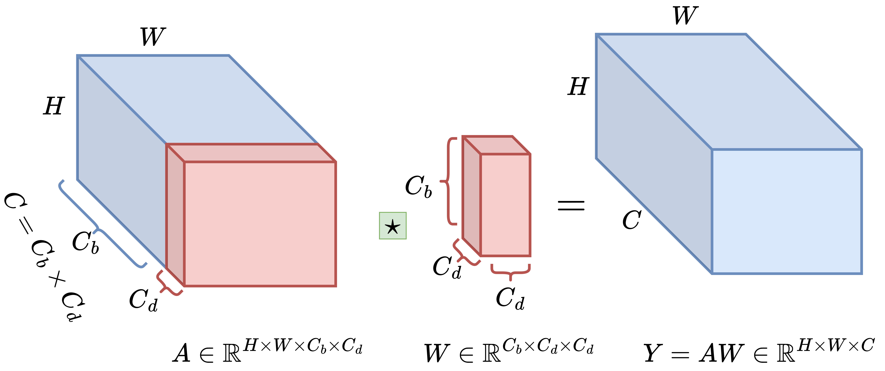
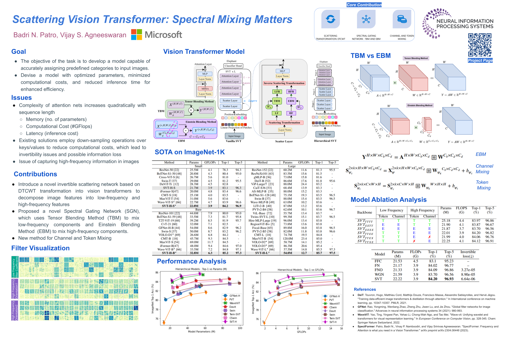
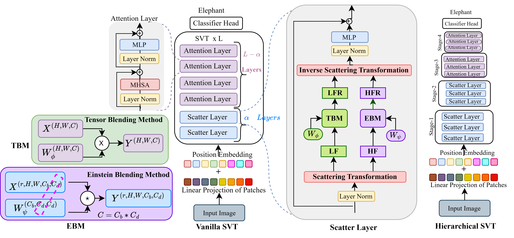

# Scattering Vision Transformer: Spectral Mixing Matters -NeurIPS 2023




[](https://arxiv.org/abs/2311.01310)
[](https://badripatro.github.io/svt/)
[](https://badripatro.github.io/svt/images/NeurIPS_2023_Poster_SVT.pdf)

## NeurIPS Poster



## Abstract

'''
Vision transformers have gained significant attention and achieved state-of-the-art performance in various computer vision tasks, including image classification, instance segmentation, and object detection. However, challenges remain in addressing attention complexity and effectively capturing fine-grained information within images. Existing solutions often resort to down-sampling operations, such as pooling, to reduce computational cost. Unfortunately, such operations are non-invertible and can result in information loss. In this paper, we present a novel approach called Scattering Vision Transformer (SVT) to tackle these challenges. SVT incorporates a spectrally scattering network that enables the capture of intricate image details. SVT overcomes the invertibility issue associated with down-sampling operations by separating low-frequency and high-frequency components. Furthermore, SVT introduces a unique spectral gating network utilizing Einstein multiplication for token and channel mixing, effectively reducing complexity. We show that SVT achieves state-of-the-art performance on the ImageNet dataset with a significant reduction in a number of parameters and FLOPS. SVT shows 2\% improvement over LiTv2 and iFormer. SVT-H-S reaches 84.2\% top-1 accuracy, while SVT-H-B reaches 85.2\% (state-of-art for base versions) and SVT-H-L reaches 85.7\% (again state-of-art for large versions). SVT also shows comparable results in other vision tasks such as instance segmentation. SVT also outperforms other transformers in transfer learning on standard datasets such as CIFAR10, CIFAR100, Oxford Flowers, and Stanford Car datasets.
'''



## SOTA Performance on the ImageNet-1K dataset for image size 224 x 224 for  Image Recognition Task


## Requirement:

```
* PyTorch 1.10.0+
* Python3.8
* CUDA 10.1+
* [timm](https://github.com/rwightman/pytorch-image-models)==0.4.5
* [tlt](https://github.com/zihangJiang/TokenLabeling)==0.1.0
* pyyaml
* apex-amp
* DTCWT [pytorch_wavelets](https://github.com/fbcotter/pytorch_wavelets)
```


## Data Preparation

Download and extract ImageNet images from http://image-net.org/. The directory structure should be

```

│ILSVRC2012/
├──train/
│  ├── n01440764
│  │   ├── n01440764_10026.JPEG
│  │   ├── n01440764_10027.JPEG
│  │   ├── ......
│  ├── ......
├──val/
│  ├── n01440764
│  │   ├── ILSVRC2012_val_00000293.JPEG
│  │   ├── ILSVRC2012_val_00002138.JPEG
│  │   ├── ......
│  ├── ......

```


### Model Zoo

We provide baseline SVT Hierarchical models pre-trained on ImageNet1k 2012, using the distilled version of our method:

| name | resolution | #params | FLOPs | Top-1 Acc. | Top-5 Acc. |
| :---: | :---: | :---: | :---: | :---: | :---: |
| SVT-H-S | 224 | 22.0M | 3.9 | 84.2  | 96.9 |
| SVT-H-B | 224 | 32.8M | 6.3 |  85.2 | 97.3 |
| SVT-H-L | 224 | 54.0M | 12.7 | 85.7 | 97.5 | 


## Train SVT small model

```
python3 -m torch.distributed.launch \
   --nproc_per_node=8 \
   --nnodes=1 \
   --node_rank=0 \
   --master_addr="localhost" \
   --master_port=12346 \
   --use_env main.py --config configs/svt/svt_s.py --data-path /export/home/dataset/imagenet --epochs 310 --batch-size 128 \
   --token-label --token-label-size 7 --token-label-data /export/home/dataset/imagenet/label_top5_train_nfnet
```


## Train SVT Base model

```
python3 -m torch.distributed.launch \
   --nproc_per_node=8 \
   --nnodes=1 \
   --node_rank=0 \
   --master_addr="localhost" \
   --master_port=12346 \
   --use_env main.py --config configs/svt/svt_b.py --data-path /export/home/dataset/imagenet --epochs 310 --batch-size 128 \
   --token-label --token-label-size 7 --token-label-data /export/home/dataset/imagenet/label_top5_train_nfnet
```

## Train SVT Large model

```
python3 -m torch.distributed.launch \
   --nproc_per_node=8 \
   --nnodes=1 \
   --node_rank=0 \
   --master_addr="localhost" \
   --master_port=12346 \
   --use_env main.py --config configs/svt/svt_l.py --data-path /export/home/dataset/imagenet --epochs 310 --batch-size 128 \
   --token-label --token-label-size 7 --token-label-data /export/home/dataset/imagenet/label_top5_train_nfnet
```

## Citation

If you find our work useful in your research, please consider citing us.

```
@inproceedings{patro2023svt,
  title={Scattering Vision Transformer: Spectral Mixing Matters},
  author={Patro, Badri N. and Agneeswaran, Vijay Srinivas},
  journal={Advances in Neural Information Processing Systems (NeurIPS)},
  year = {2023}
}
```

## Acknowledgements
Thanks the contribution of [DeiT](https://github.com/facebookresearch/deit), [WaveVit](https://github.com/YehLi/ImageNetModel), [GFNet](https://github.com/raoyongming/GFNet) and [SpectFormer](https://badripatro.github.io/SpectFormers/).
